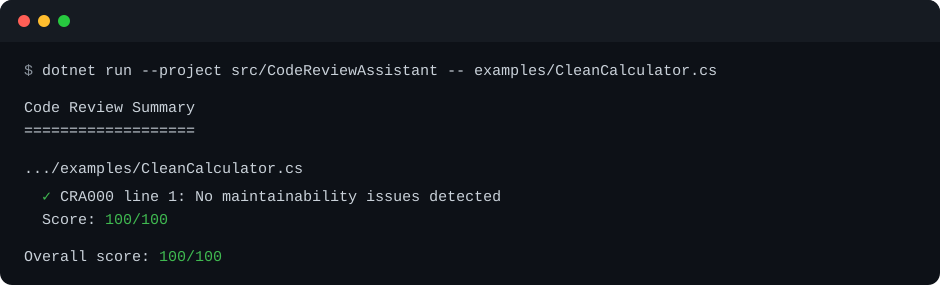
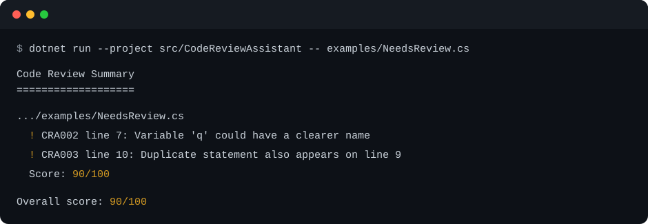
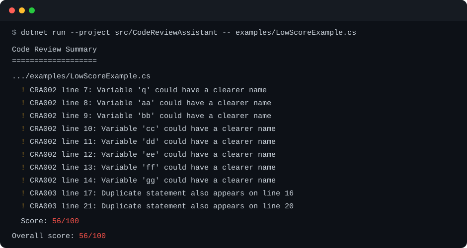

# Code Review Assistant

[](#tests)

A small, deterministic C# command-line tool that reviews C# source code locally. It uses Roslyn syntax trees and semantic models and does not send source code to an AI service.

The analyzer detects:

- methods longer than 50 lines (`CRA001`);
- unclear one- or two-character local variable names (`CRA002`);
- repeated non-trivial statements (`CRA003`).

Each file receives a maintainability score out of 100. This score is a lightweight signal, not a substitute for compiler diagnostics or human review.

## Requirements

- .NET SDK 10

## Build and run

```bash
dotnet build
dotnet run --project src/CodeReviewAssistant -- path/to/file-or-directory
```

To review this repository:

```bash
dotnet run --project src/CodeReviewAssistant -- src
```

## Configuration

All rules use sensible defaults, but you can customize them with a `.codereview.json` file:

```json
{
  "cra001": {
    "enabled": true,
    "maxLines": 40,
    "penalty": 10
  },
  "cra002": {
    "enabled": true,
    "allowedNames": ["i", "j", "id"],
    "penalty": 4
  },
  "cra003": {
    "enabled": true,
    "penalty": 6
  }
}
```

When no `--config` option is provided, the CLI looks for `.codereview.json` in the analyzed file or directory and then searches its parent directories. You can select a file explicitly instead:

```bash
dotnet run --project src/CodeReviewAssistant -- src --config team-rules.json
```

The repository includes a runnable example at [`examples/strict-rules.json`](examples/strict-rules.json).

Configuration values:

- `enabled` turns an individual rule on or off.
- `penalty` controls how many points each finding removes from the file score.
- `maxLines` sets the `CRA001` long-method threshold.
- `allowedNames` replaces the default short-name allowlist used by `CRA002`.

Invalid properties, negative penalties, invalid thresholds, and empty allowed names produce a clear configuration error.

## Examples

### Example 1: clean source code

Run the analyzer against [`examples/CleanCalculator.cs`](examples/CleanCalculator.cs):

```bash
dotnet run --project src/CodeReviewAssistant -- examples/CleanCalculator.cs
```

The analyzer finds no maintainability issues and awards the file a score of 100:



### Example 2: source code that needs review

[`examples/NeedsReview.cs`](examples/NeedsReview.cs) contains a short local variable name and a repeated statement. Analyze it with:

```bash
dotnet run --project src/CodeReviewAssistant -- examples/NeedsReview.cs
```

Roslyn identifies both findings with their source lines and applies the corresponding score penalties:



### Example 3: low-scoring source code

[`examples/LowScoreExample.cs`](examples/LowScoreExample.cs) keeps the code simple but intentionally uses eight unclear variable names and repeats two statements:

```bash
dotnet run --project src/CodeReviewAssistant -- examples/LowScoreExample.cs
```

The default penalties deduct 32 points for naming findings and 12 points for duplicate statements, producing a score of 56:



## Tests

The smoke-test project avoids an external test framework and can be run directly:

```bash
dotnet run --project tests/CodeReviewAssistant.Tests
```

## Current scope

Roslyn provides formatting-independent parsing and symbol-aware analysis. The current rules remain intentionally focused: each file is compiled independently, so analysis that requires a complete project compilation is not yet available. Future versions should add project/solution loading and machine-readable output for CI integrations.
